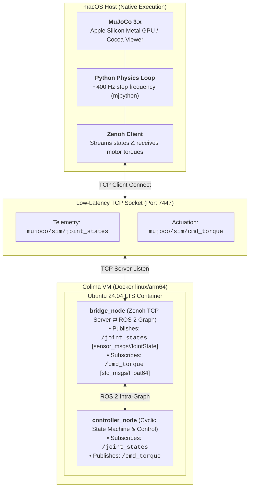

# ROS 2 Jazzy <-> Native MuJoCo macOS Stack

A free and open-source stack for running **ROS 2 Jazzy** inside an isolated Linux container while executing **MuJoCo with native Apple Silicon GPU acceleration on macOS**.

---

## Contents
1. [Quick Overview](#quick-overview)
2. [Prerequisites](#prerequisites)
3. [Quickstart Setup](#quickstart-setup)
4. [Running the Demo](#running-the-demo)
5. [Running ROS 2 Commands Easily](#running-ros-2-commands-easily)
6. [Software Stack](#software-stack)
   - [The Apple Silicon Robotics Bottleneck](#the-apple-silicon-robotics-bottleneck)
   - [The Split Architecture](#the-split-architecture)
   - [Virtualization: Colima, Apple VZ, and VirtioFS](#virtualization-colima-apple-vz-and-virtiofs)
   - [Communication: Why Zenoh Over Standard DDS](#communication-why-zenoh-over-standard-dds)
   - [Window Management & macOS Main Thread (`mjpython`)](#window-management--macos-main-thread-mjpython)
   - [ROS 2 Package Architecture & QoS Design](#ros-2-package-architecture--qos-design)
7. [Troubleshooting](#troubleshooting)
8. [Licenses](#licenses)

---

## Quick Overview

**RUNNING ROBOTICS ON APPLE SILICONE**
* **Linux VMs** heavy battery usage and zero access to the M-series GPU cores.
* **Docker with VNC or XQuartz** uses Mesa 3D graphics causing stuttering and frame drops.
* **Native macOS ROS 2 builds** lack support for Linux-specific drivers, hardware interfaces, and `apt` dependencies.

**THIS SOFTWARE STACK**
* **ROS 2 Compute Layer (Ubuntu 24.04 ARM64 Container)**: Runs controllers, planners, nodes, and build tooling inside a Colima-managed container that matches Linux deployment hardware.
* **Simulation & Graphics Layer (Native macOS)**: Runs MuJoCo natively on the host, using M-series chip GPU via Cocoa.
* **Communication (Eclipse Zenoh)**: Streams joint telemetry and control efforts over a dedicated local TCP socket at ~400 Hz.

---

## Prerequisites

* Apple Silicon Mac (M1/M2/M3/M4/M5, 16 GB+ RAM recommended)
* [Homebrew](https://brew.sh) installed

Install the open-source container engine and tooling:
```bash
brew install colima docker docker-compose docker-buildx python@3.11
```

---

## Quickstart Setup

### 1. Start the Virtualization Runtime
Start Colima using Apple's native Virtualization framework (`vz`), high-throughput file mounts (`virtiofs`), and an accessible network interface:

```bash
colima start --cpu 8 --memory 24 --disk 80 --vm-type vz --mount-type virtiofs --arch aarch64 --network-address
```

Verify your Colima VM IP:
```bash
colima list
```
*(Find the IP in the `ADDRESS` column, This is your `<COLIMA_IP>`.)*

### 2. Build and Launch the ROS 2 Container
```bash
cd ~/Desktop/ros2/docker
docker-compose up -d --build
```

### 3. Build the ROS 2 Workspace
Compile the `mujoco_pendulum_bridge` package inside the container:
```bash
docker exec -it -w /jazzy_ws ros2_jazzy_core bash -c "source /opt/ros/jazzy/setup.bash && colcon build --symlink-install"
```

### 4. Setup the Native macOS Python Environment
In a native macOS terminal, create a virtual environment for MuJoCo:
```bash
cd ~/ros2-jazzy-macos/macos_sim
/opt/homebrew/opt/python@3.11/bin/python3.11 -m venv venv
source venv/bin/activate
pip install --upgrade pip
pip install mujoco eclipse-zenoh numpy
```

> **Note**: Verify that `COLIMA_IP` in `~/Desktop/ros2/macos_sim/sim_bridge.py` matches the IP returned from `colima list`.

---

## Running the Demo

You only need two commands running in separate terminal tabs:

### Terminal 1: Launch the ROS 2 Bridge & Controller (Container)
```bash
docker exec -it -w /jazzy_ws ros2_jazzy_core bash -c "source /opt/ros/jazzy/setup.bash && source install/setup.bash && ros2 launch mujoco_pendulum_bridge pendulum_demo.launch.py"
```

### Terminal 2: Launch the MuJoCo Simulation (macOS Host)
```bash
cd ~/Desktop/ros2/macos_sim
source venv/bin/activate
mjpython sim_bridge.py
```

### What You'll See
1. A native macOS window launches showing the rendered model.
2. The ROS 2 controller executes an automated cyclic state machine:
   * **Phase 1 (`PUSH`)**: The controller commands a +8.0 N·m kick to destabilize the system.
   * **Phase 2 (`FREE`)**: Actuation zeroes out for 8.0s, letting the system coast unactuated.
   * **Phase 3 (`STABILIZE`)**: The PD controller engages, catching and balancing the joint upright at 0.0 rad for 8.0s.
   * **Repeat**: The state machine loops automatically.

---

## Running ROS 2 Commands Easily

Instead of typing long `docker exec` commands every time, use these shortcuts:

### 1. Add a Terminal Shortcut to macOS
Add this alias to your Mac's `~/.zshrc`:
```bash
echo 'alias ros2-shell="docker exec -it -w /jazzy_ws ros2_jazzy_core bash"' >> ~/.zshrc
source ~/.zshrc
```

Now, simply typing `ros2-shell` in any terminal drops you directly into an interactive shell inside the container workspace.

### 2. Auto-Source the Workspace inside the Container
Run this once inside the container shell so every new terminal session automatically loads your ROS 2 environment:
```bash
echo "source /opt/ros/jazzy/setup.bash" >> ~/.bashrc
echo "if [ -f /jazzy_ws/install/setup.bash ]; then source /jazzy_ws/install/setup.bash; fi" >> ~/.bashrc
source ~/.bashrc
```

### 3. Common ROS 2 Commands (inside `ros2-shell`)
* **List active topics:**
  ```bash
  ros2 topic list
  ```
* **Verify update frequency (should report ~400 Hz):**
  ```bash
  ros2 topic hz /joint_states
  ```
* **Read live joint telemetry:**
  ```bash
  ros2 topic echo /joint_states
  ```
* **Monitor commanded controller efforts:**
  ```bash
  ros2 topic echo /cmd_torque
  ```
* **Inspect configurable node parameters:**
  ```bash
  ros2 param list
  ```
* **Tune gains live at runtime without restarting:**
  ```bash
  ros2 param set /controller_node kp 50.0
  ros2 param set /controller_node push_torque 10.0
  ```
* **Rebuild workspace after editing files:**
  ```bash
  colcon build --packages-select mujoco_pendulum_bridge --symlink-install
  source install/setup.bash
  ```

---

## Software Stack



### The Apple Silicon Robotics Bottleneck
ROS 2 development on modern Apple hardware runs into a architectural conflicts:
1. ROS 2 relies heavily on the Linux ecosystem
2. macOS hypervisors cannot pass Apple Silicon GPU acceleration through to Linux container runtimes.
3. Running 3D simulation tools inside Linux containers on macOS forces software-based rendering, turning the CPU into an inefficient graphics processor and reducing compute.
4. X11 socket forwarding (XQuartz) or remote desktop streams (VNC/noVNC) introduce network buffering lag, frame dropping, and poor refresh rates.

### The Split Architecture
To bypass this limitation entirely, the architecture decouples graphics and physics from the control stack:
* **Physics & Visualization** runs natively on macOS, taking advantage of unified memory and GPU cores.
* **Control, Estimation, and ROS 2 Graph Management** runs inside an isolated Ubuntu 24.04 ARM64 container, guaranteeing compatibility with production Linux targets.

### Virtualization: Colima, Apple VZ, and VirtioFS
To keep the toolchain 100% open-source and free for commercial use, the container runtime is built on **Colima** (MIT licensed) rather than Docker Desktop:
* `--vm-type vz`: Uses Apple's native **Virtualization.framework** instead of QEMU emulation. It runs code on native ARM64 CPU cores with virtually zero hypervisor overhead.
* `--mount-type virtiofs`: Implements a high-throughput, kernel-level virtual file system pass-through. Code changes made in your native macOS editor (VS Code, Zed, Cursor) sync into `/jazzy_ws` inside the container immediately without delays.
* `--network-address`: Allocates an explicit, routable bridge IP to the Colima virtual machine, enabling host processes to communicate directly with container ports.

### Communication: Why Zenoh Over Standard DDS?
Standard ROS 2 uses **DDS (Data Distribution Service)**, which relies heavily on UDP multicast discovery to find neighboring nodes.
* Across the macOS-to-VM virtualization boundary, UDP multicast packets are frequently blocked or dropped by internal NAT network bridges.
* Configuring DDS unicast peering across platforms requires complex XML configuration files that break whenever an interface or IP changes.

**Eclipse Zenoh** eliminates this:
* Zenoh is an open-source, ultra-low-overhead network protocol built specifically for high-throughput robotics data.
* `bridge_node` acts as a **Zenoh peer/server** listening directly on `tcp/0.0.0.0:7447` inside the container.
* The native macOS Python simulation script acts as a **Zenoh client**, connecting over standard TCP.
* Telemetry and actuator commands travel across this socket at ~400 Hz.

### Window Management & macOS Main Thread (`mjpython`)
Launching MuJoCo's interactive viewer on macOS using the standard Python interpreter (`python sim_bridge.py`) triggers a runtime crash:
```text
RuntimeError: `launch_passive` requires that the Python script be run under `mjpython` on macOS
```
* **The Cause**: macOS UI frameworks (Cocoa and AppKit) require display windows to be managed by an `NSApplication` event loop running exclusively on the OS main thread (Thread 0). Standard CPython binaries on macOS do not initialize Cocoa application lifecycles by default.
* **The Solution**: The `mujoco` package includes **`mjpython`**, a dedicated launcher binary that wraps Python execution inside a native macOS Cocoa context, granting the viewer full access to the display server and Metal acceleration pipelines.

### ROS 2 Package Architecture & QoS Design
The `mujoco_pendulum_bridge` package contains two nodes designed to operate with standard ROS 2 tooling:

1. **`bridge_node`**:
   * Initializes the Zenoh TCP listener on port 7447.
   * Ingests high-frequency joint telemetry from the Zenoh socket and formats it into standard `sensor_msgs/msg/JointState` messages.
   * Publishes using ROS 2's default **Reliable** Quality of Service (QoS). This prevents incompatibilities with introspective tools, DDS bridges, and subscribers that expect reliable delivery.
   * Subscribes to `/cmd_torque` (`std_msgs/msg/Float64`) and pushes commanded efforts back to the native simulation socket.

2. **`controller_node`**:
   * Subscribes to `/joint_states` and manages an automated, non-blocking state machine (`PUSH` -> `FREE` -> `STABILIZE`).
   * Implements closed-loop feedback calculation and clamps outputs to defined actuator limits.
   * Exposes gains, timing durations, and limits via standard ROS 2 parameters (`params.yaml`), allowing parameters to be reconfigured live with `ros2 param set`.

---

## Troubleshooting

### 1. `Connection refused: tcp/192.168.64.X:7447`
* **Cause**: `sim_bridge.py` was launched before `pendulum_demo.launch.py`, or Colima was restarted and received a new IP address.
* **Fix**: Ensure the ROS 2 launch file is running first. Then run `colima list` to verify the IP matches `COLIMA_IP` in `sim_bridge.py`.

### 2. `pip install error: externally-managed-environment`
* **Cause**: Ubuntu 24.04 (Noble) enforces PEP 668 to protect system Python packages from being overwritten by pip.
* **Fix**: When installing pip packages inside the container, pass the `--break-system-packages` flag:
  ```bash
  pip3 install --break-system-packages <package-name>
  ```

### 3. Missing Sourcing / "Command Not Found"
* **Cause**: Running ROS 2 commands from the host terminal instead of inside the container, or launching a new container shell without sourcing setup files.
* **Fix**: Use the `ros2-shell` alias and ensure both `/opt/ros/jazzy/setup.bash` and `/jazzy_ws/install/setup.bash` are added to `~/.bashrc`.

---

## Licenses

Every component of this stack is released under permissive, free-and-open-source licenses, making it completely free for commercial development and production deployment:
* **ROS 2 Jazzy**: Apache 2.0
* **MuJoCo**: Apache 2.0
* **Eclipse Zenoh**: Apache 2.0 / EPL 2.0
* **Colima**: MIT
* **Docker CLI & Compose**: Apache 2.0
* **Ubuntu Base Image**: Canonical Open Source (Free for distribution)
